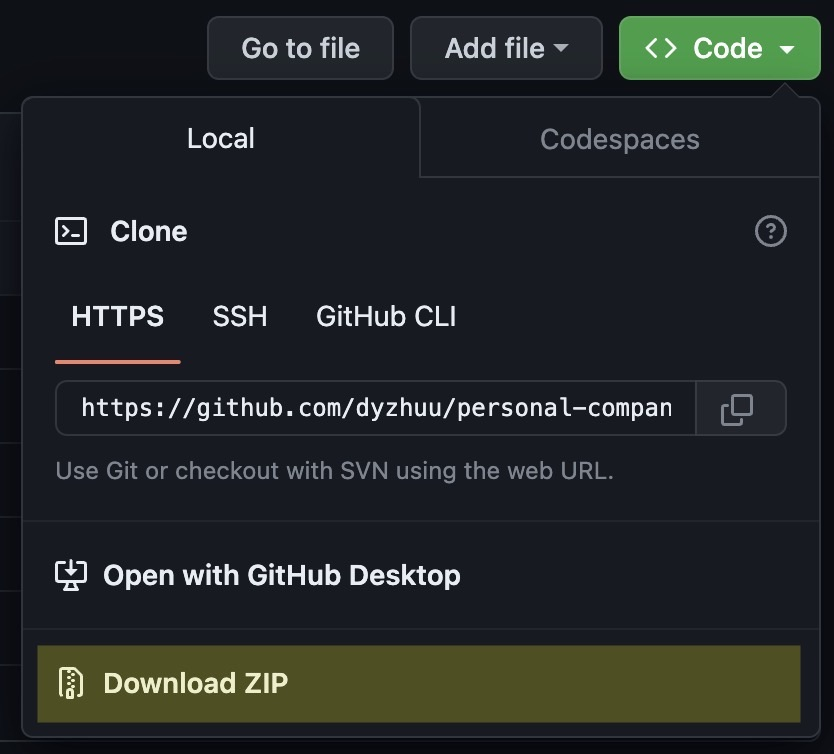
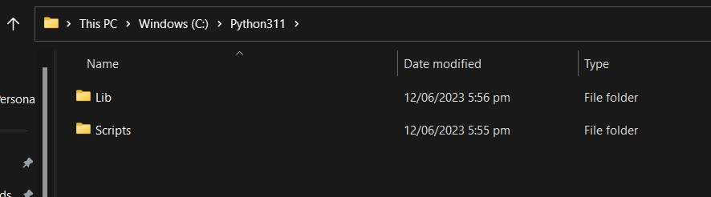
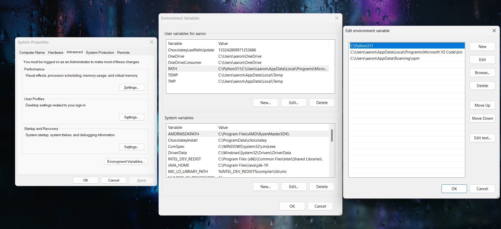
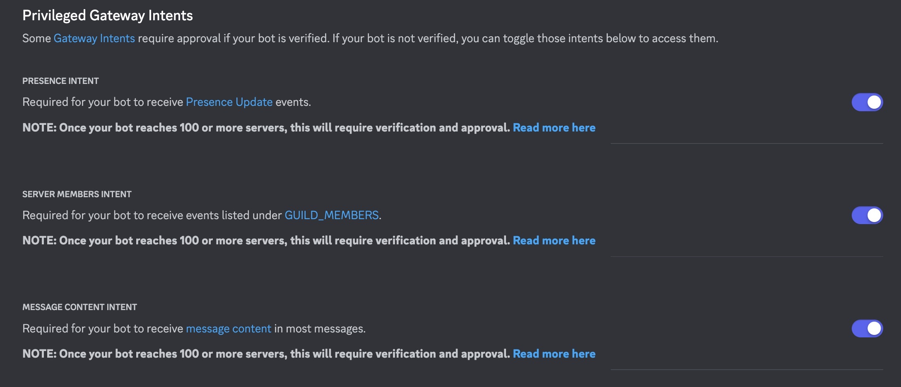
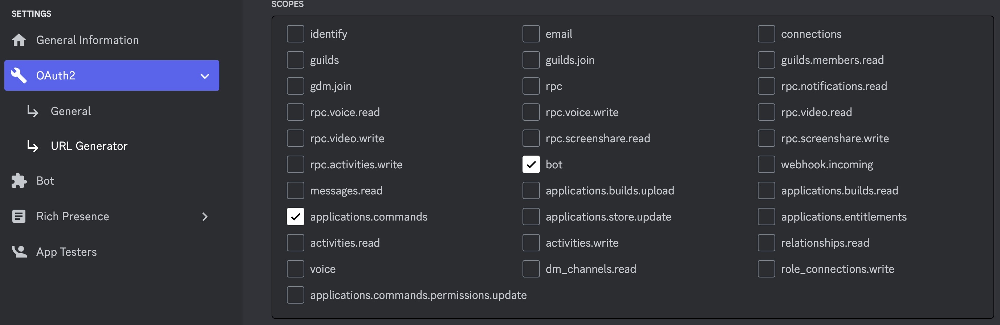
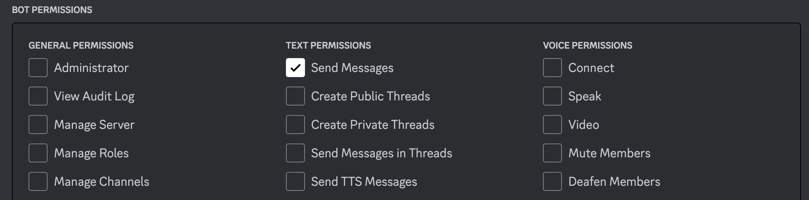

# Personal Companion Discord Bot

## Presented by GDSC - Google Developer Student Club

🤖 Introduction to Discord Bot Development 🤖

Welcome to the GDSC Personal Companion Discord Bot Event! We are thrilled to have you here for an exciting journey into the world of AI-powered Discord bots! This event is all about creating your very own personal companion bot, which will be your loyal virtual friend on Discord. Whether you prefer to work individually or in groups, this event offers a fantastic opportunity to learn, collaborate, and build something truly awesome!

🚀 What to Expect 🚀

During this session, you will gain hands-on experience in building an AI-driven Discord bot using the power of OpenAI API and the Discord API. Our talented mentors and organizers are ready to guide you every step of the way, providing you with valuable insights into bot development, AI integration, and creative custom features.

🎯 Learning Objectives 🎯

By the end of the event, you will:

Master the basics of Discord bot development.
Harness the potential of OpenAI API to imbue your bot with AI capabilities.
Utilize the Discord API to seamlessly integrate your bot into Discord servers.
Understand how to expand your bot's functionalities with custom commands and interactions with other APIs.

Happy coding! 🚀🤖

---

## Step 1: Clone The Repository
Download the code by clicking the green `Code` button and then `Download ZIP`

---

## Step 2: Install Software

### Step 2.1: Install Python
To get started, you first need [install Python](https://www.python.org/downloads/). If you already have Python, you can move on to the next step.

Double-check that Python and pip are installed by running `python3 --version` and `pip --version`in your CLI.\
**(use `python` if `python3` doesn't work)**

It should tell you the respective version numbers in the form of `Python 3.x.x` and `pip 23.x.x`

**FOR WINDOWS DEVICES:** If the above fails, try the following:

# ❗❗TODO:

- Find your Python path (where Python was just installed on your computer, note that it may be different from the image below)

- Search for "Edit the system environment variables" in Windows search, and add the path that you found previously to the `PATH` variable. See below.

---

### Step 2.2: Create Environment
Open the code in your IDE of choice. If you don't have one already, you can install a free one [here](https://code.visualstudio.com/download)

Open up the CLI and enter the command:

`pip install virtualenv`

cd into your project folder and run

`virtualenv venv`

You should see that a folder named `venv` has been created.

**Mac / Linux:** `source venv/bin/activate`\
**Windows:** `venv\Scripts\activate`

Once the venv has been activated, you should see `(venv)` at the beginning of the path. You can now install the required modules using the following command:

`pip install -r requirements.txt`

You can do a final check with `pip list` to see that all the modules have been installed correctly.

---
# ❗❗TODO:

## Step 3: Configuration Setup

### Step 3.1: Discord Bot setup
To create and configure a discord bot, head to the [Discord Developer Portal](https://discord.com/developers/applications)

Once you have logged in, click `New Application` in the top left corner.

Enter the details and then enter into the application.

Click on the `Bot` tab on the left, this is where you can set the name and icon of your bot.

Scroll down and enable all **Privileged Gateway Intents**

Navigate to the `OAuth2` tab and click on `URL Generator`

Enable the `bot` and `applications.commands` **scopes**

Enable `Send Messages` under **Bot Permissions**, along with any other permissions you wish to grant your bot.

### Step 3.2: OpenAi Api key

---

## Step 4: Run

---

## Step 5: Extra for Experts
- Custom commands
    - Go beyond the basics and experiment with creating more advanced custom commands. Learn to handle parameters, aliases, and complex formatting to give your bot a unique edge.
- Explore OpenAI
    - Delve into OpenAI's features. Try adjusting parameters like temperature and max tokens to fine-tune your bot's responses for different contexts, adding depth to your bot's interactions.
    - Temperature: a parameter that determines the randomness of the model's output. 
        - For example, a high temperature (e.g 0.8) will be beneficial when a creative response is needed, however there is a higher chance that the output will be nonsensical. A low temperature (e.g. 0.2) will stick to the most probable output and is good for straightforward tasks where a consistent answer is needed. 
    - Max tokens: a parameter that sets the limit on the number of token's in the model's output. 
        - For example, a short output (e.g max 40 tokens) can be used if you are wanting short answers or are looking for concise information. A long output (e.g. max 500 tokens) can be used for a more detailed answer. 
    - When using these parameters, you can adjust them to fit your application and it is a good idea to test various settings to see which one works best. 
- Read up on the [discord.py documentation](https://discordpy.readthedocs.io/en/stable/intro.html) to learn more about the features and intricacies of Python discord bots.

These suggestions offer participants a chance to deepen their understanding of bot customization and OpenAI's capabilities. Happy coding! 🚀🤖
